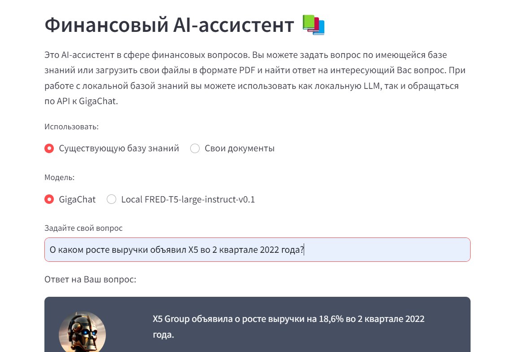
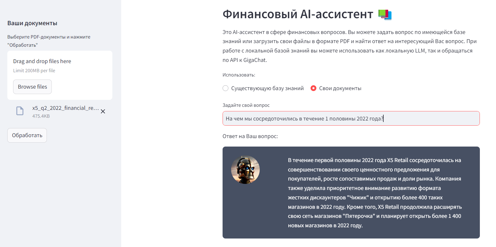
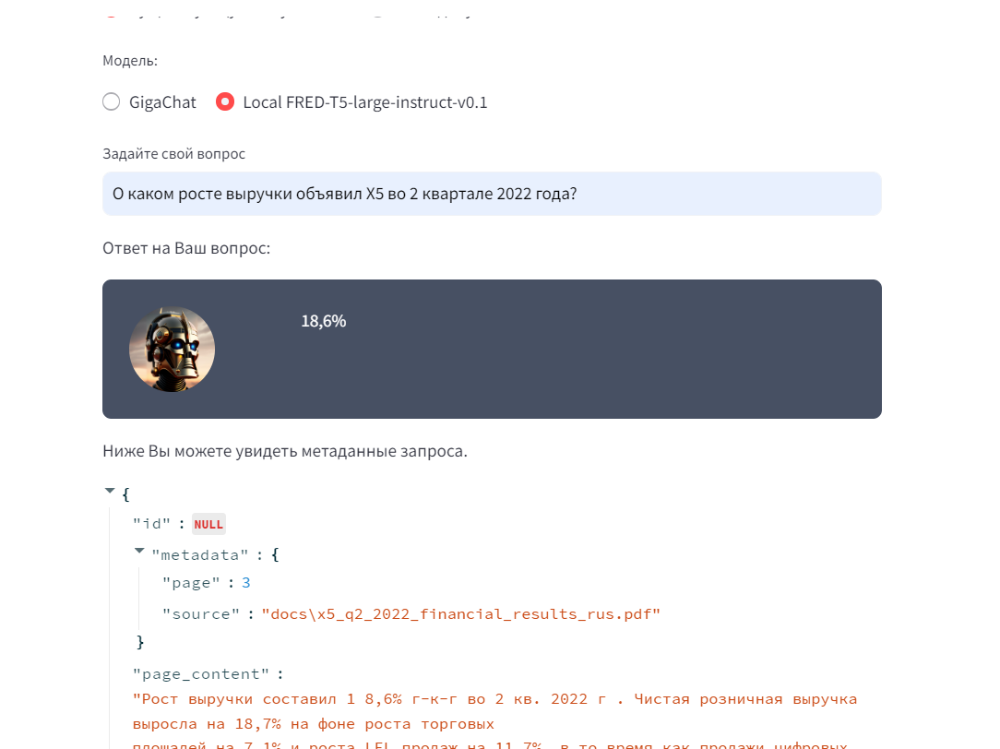
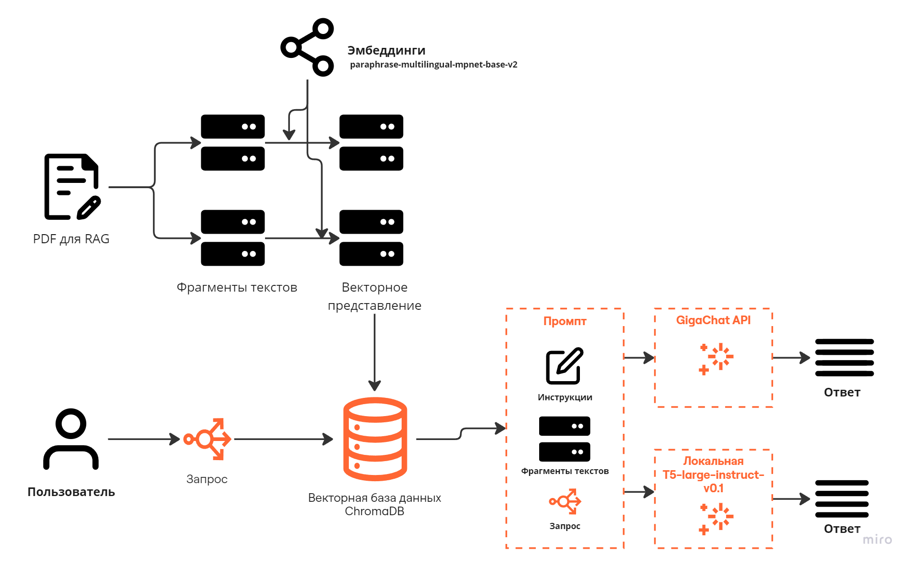

# AI-ассистент по финансовым вопросам


### Использование API GigaChat


----

### Использование локальной LLM (T5-large-instruct-v0.1)


----

### Возможность поиска по собственным документам, вне существующей базы знаний


----

## Архитектура решения


* ассистента разработан на основе LangChain
* В качестве LLM используется GigaChat, локально развернута LLM T5-large-instruct-v0.1
* В качестве embedding-модели используется paraphrase-multilingual-mpnet-base-v2
* Добавлена возможность самостоятельной загрузки пользователем своих PDF-документов и создания временной векторной БД на основе FAISS

### Структура проекта

```
├── app.py # основная директория проекта
├── docs # содержит данные для проекта
├── vectorbase_creation # скрипт для создания БД
├── htmlTemplates # более приятный интерфейс для streamlit
├── vectorbase # БД на основе ChromaDB
├── README.md
├── requirements.txt
└── resources # ресурсы проекта
```

# How to run? Запуск решения

## Development

0. Install requirements

```
pip install -r requirements.txt
```

1. Create `.env` in the `./app` dir

``` 
credentials=GIGACHAT AUTH DATA (GigaChat for developers -> secret )
```
2. Run vectorbase_creation.py script to create an instance of ChromaDB vectorbase for docs searching
3. Run app.py. **Note**:
 use **checkpoint** to download LLM model. For later development, use **model_path** instead not to re-download the model each time you run the app
   
```
python3.12 -m streamlit run app.py
```


